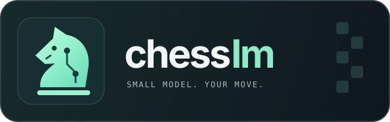

<p align="center">
  
</p>

<h1 align="center">chesslm</h1>

<p align="center">
  A tiny neural chess evaluator with alpha-beta search and a desktop chess game.
</p>

<p align="center">
  <a href="#quick-start"></a>
  <a href="#how-it-works"></a>
  <a href="#how-it-works"></a>
  <a href="requirements.txt"></a>
</p>

<p align="center">
  <a href="#quick-start">Quick start</a> ·
  <a href="#desktop-game">Desktop game</a> ·
  <a href="#training">Training</a> ·
  <a href="#benchmarking">Benchmarking</a> ·
  <a href="#development">Development</a>
</p>

chesslm combines a small NumPy network with a fixed material evaluator to choose
chess moves. Play against the included `model.npz` in a Tkinter window, or request
a move from the command line. Playing uses your CPU and requires no Stockfish
process. Stockfish supplies training labels and benchmark comparisons.

The network has 100,353 parameters and 401,412 bytes of float32 weights, about
392 KiB. Despite the name, it is not a language model. The included checkpoint's
training history and playing strength have not been verified; no Elo is claimed.

## Quick start

Use Python 3.10 or newer. Run these commands in a POSIX shell:

```sh
git clone https://github.com/skorotkiewicz/chesslm.git
cd chesslm
python -m venv .venv
. .venv/bin/activate
python -m pip install -r requirements.txt
python chess_game.py
```

The desktop game needs Tkinter and a display. Some Linux distributions provide
Tkinter separately in a package named `python3-tk` or `tk`. On Windows, activate
the environment with `.venv\Scripts\Activate.ps1` in PowerShell.

For a terminal-only first move, run this from the project directory:

```sh
OPENBLAS_NUM_THREADS=1 python chesslm.py play --model model.npz
```

The `OPENBLAS_NUM_THREADS=1` prefix limits OpenBLAS threading for the small
network. In PowerShell, set `$env:OPENBLAS_NUM_THREADS = "1"` before running the
Python command. The desktop game sets this default automatically.

<details>
<summary id="desktop-game">Desktop game</summary>

```sh
python chess_game.py
python chess_game.py --color black
python chess_game.py --model model.npz --depth 3 --max-nodes 20000
```

Click a piece, then its destination. Dots and rings mark legal moves, and buttons
let you choose a promotion piece. Use arrow keys and Enter or Space to move with
the keyboard; Tab reaches the buttons. Playing as Black flips the board.

Search runs in a background thread, so the window can redraw and close while the
model thinks. New game becomes available after the search finishes. The default
checkpoint is `model.npz` beside the script.

If you use `uv`, you can also launch the game without setting up `.venv`:

```sh
uv run --python /usr/bin/python chess_game.py
uv run --python /usr/bin/python chess_game.py --color black
```

These examples use a Linux system Python with Tkinter installed. Choose a
Python with Tkinter on your platform. `uv` installs the script's declared NumPy
and python-chess dependencies in an isolated environment.

</details>

<details>
<summary id="web-game">Web game</summary>

```sh
python web/chess_web.py
# Or use an isolated uv environment:
uv run --python /usr/bin/python web/chess_web.py
```

Open **http://127.0.0.1:8000** in your browser. Choose White or Black, then click
a piece and its destination. Legal moves are highlighted; promotions offer all
four pieces. Arrow keys and Enter work on the board. Each tab has its own game;
refreshing the page starts over.

The Python server loads `model.npz` beside the script and performs inference on
CPU. The browser does not download the model. No Stockfish, training, external
assets, or JavaScript packages are needed. Tkinter is not required.

Use `--model /path/to/model.npz`, `--port 8080`, `--depth 3`,
`--max-nodes 20000`, or `--quiescence-depth 4` to change the defaults. The server preserves move history for
repetition draws and validates every move. Games are limited to 1000 submitted
plies. One search runs at a time; another tab can retry if the model is busy.

This is a localhost-only server for personal play, not a public hosting setup.
Stop it with Ctrl+C. Keep `chess_web.html` beside `chess_web.py`.

A [Neko](https://en.wikipedia.org/wiki/Neko_(software))-style cat chases your
cursor and then scratches, grooms, yawns, and sleeps. It is drawn on a canvas
and ignores clicks; turn it off with your browser's reduced-motion setting.

<details>
<summary id="github-pages">GitHub Pages</summary>

The included [Pages workflow](.github/workflows/pages.yml) builds and deploys the
browser game when you push to `main`. In the repository, open **Settings > Pages**
and select **GitHub Actions** as the source. Push these files, or run
**Deploy chess game to GitHub Pages** from the Actions tab. For this repository,
the expected address is `https://skorotkiewicz.github.io/chesslm/`.

Pages cannot run a Python server. This build instead loads Pyodide and NumPy in
a Web Worker, then runs the same evaluator and search with the bundled
`model.npz`. The checkpoint is copied unchanged; CI does not train or generate
data. Relative asset paths support project Pages URLs such as `/chesslm/`.

The first visit downloads the Python runtime and NumPy from jsDelivr and can
take a minute on a slow connection. Browser inference uses depth 2 and a
2,000-node limit per move, below the local server's default budget. The UI stays
responsive while the worker searches. Refreshing discards the game.

To preview the Pages build locally, use an environment with `requirements.txt`:

```sh
python web/build_pages.py
python -m http.server 8001 --bind 127.0.0.1 --directory _site
```

Open `http://127.0.0.1:8001`. Opening `index.html` as a `file://` URL will not work.
The build bundles python-chess with its GPL license in `chess.zip`.

</details>
</details>

## Command-line play

```sh
OPENBLAS_NUM_THREADS=1 python chesslm.py play \
  --model model.npz --depth 3 --max-nodes 20000
```

The command prints JSON with `move`, a UCI move string such as `e2e4`, and `nodes`,
the visited node count. When the game has ended, `move` is `null`. Add
`--fen '...'` with a valid FEN to choose a move in another position.

This command chooses one move per invocation; it does not implement a UCI engine
server. CLI model paths are relative to your working directory.

## How it works

| Component | Implementation |
| --- | --- |
| Input | 782 features: 12 piece planes, side to move, castling rights, legal en passant file, and halfmove clock |
| Network | One 128-unit tanh hidden layer, learning a correction to a fixed material evaluator |
| Target | White's evaluation, transformed with `tanh(centipawns / 600)` |
| Training | Mean squared error with Adam; save the weights with the lowest validation loss |
| Search | Iterative deepening, alpha-beta pruning, capture ordering, and configurable quiescence depth, default four plies |
| Runtime | NumPy and python-chess on CPU |

The weight size excludes the NPZ header, Python, NumPy, and process memory.

A node limit can leave only a shallow completed search iteration. If none
finishes, search returns a legal fallback move. Long tactics remain a limitation.
The game and search recognize automatic draws but do not implement optional draw
claims. A FEN does not include prior repetition history.

`--quiescence-depth` sets the maximum extra tactical plies after the main search
reaches `--depth`. One ply is one player's move. The value must be positive and
defaults to 4. The option works in the desktop game, local web server, and CLI
`play` and `benchmark` commands. The static browser game keeps the default.

For a deeper tactical search on the local server, try:

```sh
python web/chess_web.py --depth 3 --max-nodes 50000 --quiescence-depth 8
```

All main-search and quiescence nodes share the `--max-nodes` cap. Deeper quiescence
can detect longer tactical sequences, but it can also leave less budget for the
main search. It does not guarantee stronger play or eliminate missed tactics.
Increasing `--max-nodes` alone does not raise the quiescence-depth limit.

## Training

Training is optional. The included checkpoint is enough to play.

Data generation and benchmarking require a Stockfish executable. Stockfish is
not tracked in this repository. The default path is
`stockfish/stockfish-linux-x86-64-universal`, relative to `chesslm.py`, for x86-64
Linux. Supply `--engine /path/to/stockfish` to use another location or a binary
for your platform.

Run these commands on your training machine. Output files must not already
exist; `model-trained.npz` leaves the included checkpoint available.

```sh
python chesslm.py generate \
  --engine /path/to/stockfish \
  --positions 100000 --nodes 20000 --threads 2 \
  --output positions-train.jsonl

OPENBLAS_NUM_THREADS=2 python chesslm.py train \
  --data positions-train.jsonl --epochs 30 --output model-trained.npz
```

Stockfish labels self-play positions with White's centipawn evaluation using a
three-line search. Opening choices vary among those lines, with occasional
variation later. Mate labels use ±10,000 centipawns. The node budget bounds
Stockfish's search work, not elapsed time.

Validation holds out entire games and removes positions shared with those games
from training. A dataset needs at least two games and some distinct positions.
Training saves the initial weights if no epoch improves validation loss.

The dataset is loaded into memory. Input arrays need roughly 313 MB per 100,000
positions, plus JSON rows and temporary arrays. Larger datasets need more RAM.

Copy `model-trained.npz` to your playing machine and select it explicitly:

```sh
python chess_game.py --model model-trained.npz
```

## Benchmarking

Generate a separate corpus with a different seed. Do not train on this file.
Use fresh output filenames if you repeat the workflow.

```sh
python chesslm.py generate \
  --engine /path/to/stockfish \
  --seed 9001 --positions 5000 --nodes 20000 \
  --output positions-benchmark.jsonl

OPENBLAS_NUM_THREADS=1 python chesslm.py benchmark \
  --engine /path/to/stockfish \
  --model model-trained.npz --data positions-benchmark.jsonl \
  --positions 100 --nodes 50000
```

The JSON report contains the position count, best-move agreement, and mean
centipawn loss against Stockfish. These are noisy, node-limited estimates.
Different seeds can still produce repeated openings, and match testing is
needed to establish an Elo rating. A tiny distilled model should not be expected
to match Stockfish.

## Development

From the project root, in an environment containing `requirements.txt`, run:

```sh
OPENBLAS_NUM_THREADS=1 python -m unittest -v
python chesslm.py --help
python chess_game.py --help
python web/chess_web.py --help
```

Run the JavaScript checks with Node.js:

```sh
node --test tests/test_chess_web.js
```

Tests cover encoding, checkpoint size and loading, gradient math, invalid
positions, validation separation, node limits, promotions, check evasion,
forced mates, a free queen capture, and desktop interactions. GUI tests skip
when no display is available.

The tests do not run Stockfish, generate data, or optimize model weights. Search
tests use hand-set zero weights; the derivative check uses random weights
without optimization. Passing them does not measure the supplied checkpoint's
strength. Generation and training still need end-to-end verification on the
training machine.

## Project files

| File | Purpose |
| --- | --- |
| [`chesslm.py`](chesslm.py) | Model, search, data generation, training, and benchmark CLI |
| [`chess_game.py`](chess_game.py) | Tkinter desktop game |
| [`web/chess_web.py`](web/chess_web.py) | Local HTTP server and validated game API |
| [`web/chess_web.html`](web/chess_web.html) | Browser chess board |
| [`tests/test_chess_web.py`](tests/test_chess_web.py) | HTTP, rule, request-validation, and static-build checks |
| [`tests/test_chess_web.js`](tests/test_chess_web.js) | Browser winner-label and watch-mode checks |
| [`web/chess_position.py`](web/chess_position.py) | Shared move validation and board responses |
| [`web/chess_worker.js`](web/chess_worker.js) | Browser-side model inference with Pyodide |
| [`web/build_pages.py`](web/build_pages.py) | Static site build, including the unchanged model |
| [`model.npz`](model.npz) | Included checkpoint for play |
| [`requirements.txt`](requirements.txt) | Runtime dependencies |
| [`tests/test_chesslm.py`](tests/test_chesslm.py) | Model and search checks |
| [`tests/test_chess_game.py`](tests/test_chess_game.py) | Desktop game checks |

## License

MIT.
